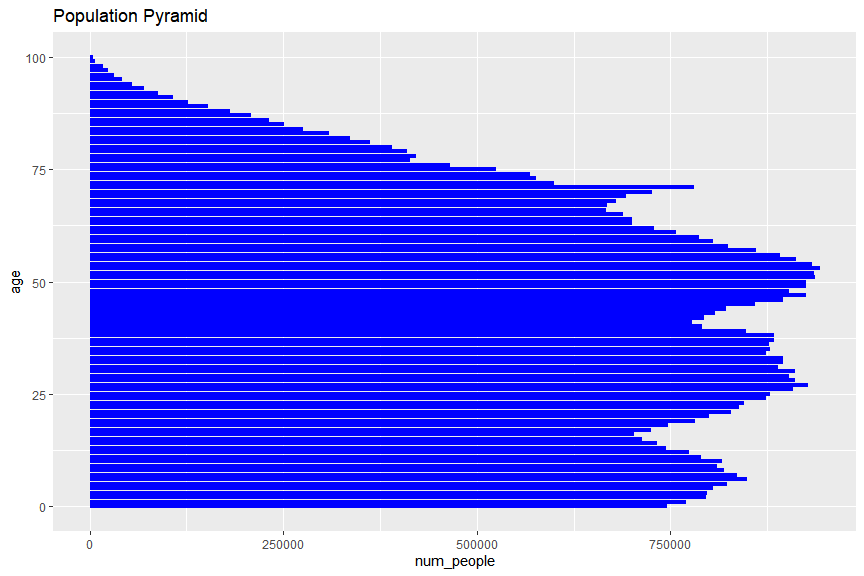
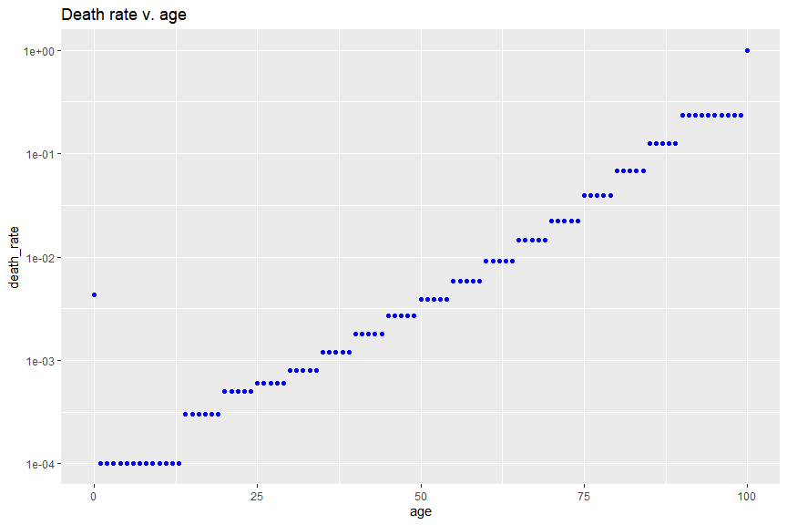
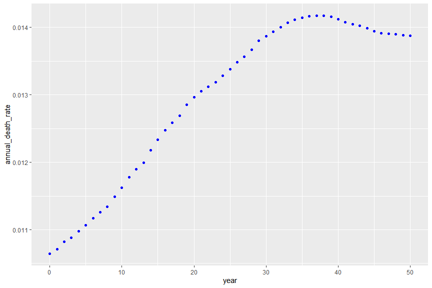
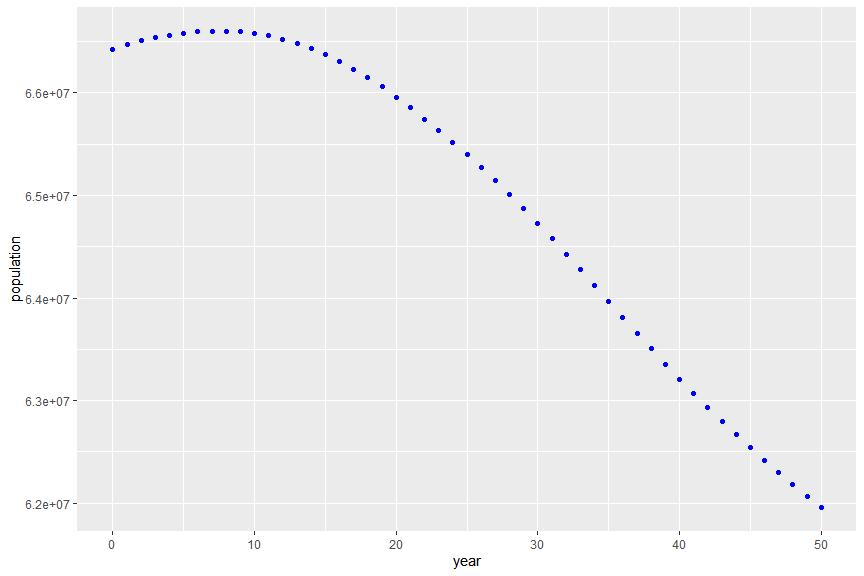
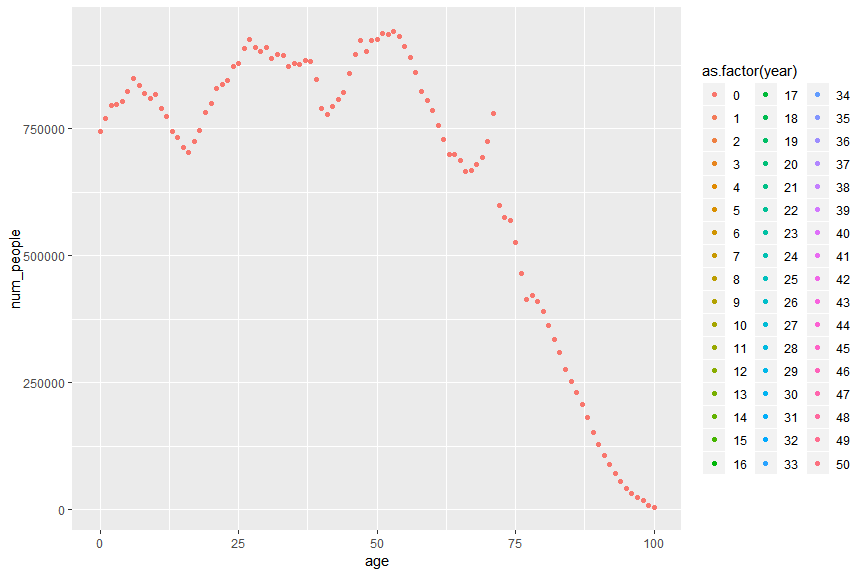
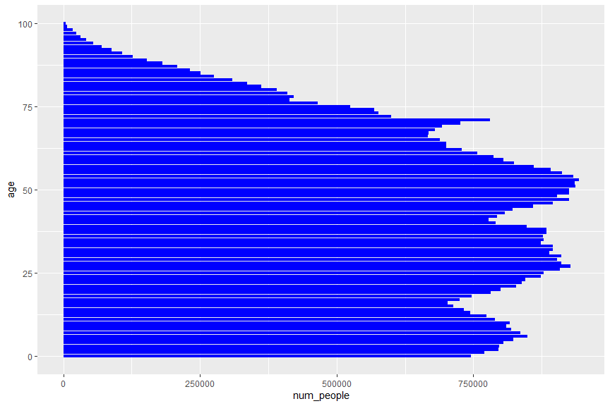

# About

What is frontloading?

# Read Input data

(add links to the sources)  
(explain assumptions)


```r
demog <- 
    inner_join(
      read.csv("input data/death_rate_v_age.csv"), 
      read.csv("input data/num_people_v_age.csv"), 
      by = "age") %>%
  mutate(year = 0)
```


```r
demog %>% 
  ggplot(aes(x = age, y = num_people)) + 
  geom_bar(stat = "identity", fill = "blue") +
  coord_flip() +
  ggtitle("Population Pyramid")
```

<!-- -->

```r
demog %>% 
  ggplot(aes(x = age, y = death_rate)) + 
  geom_point(colour = "blue") + 
  scale_y_log10() +
  ggtitle("Death rate v. age")
```

<!-- -->

```r
demog %>% summarise(num_death = sum(num_people*death_rate), population = sum(num_people))
```

```
##   num_death population
## 1  706994.8   66427385
```

```r
demog %>% summarise(annual_death_rate = sum(num_people*death_rate) / sum(num_people))
```

```
##   annual_death_rate
## 1        0.01064312
```

# Generate next years (no change in death rate)


```r
demog_next_years <- function(demog, num_years, annual_birth, corona_factor){
  demog_local <- demog
  
  for(i in (1:num_years)){
    demog_local <- 
      demog_local %>% 
      filter(year == max(year)) %>%
      mutate(death_rate = corona_factor*death_rate,
             num_people = num_people * (1-death_rate),
             num_people = num_people %>% lag(1),
             num_people = replace(num_people, is.na(num_people), annual_birth),
             year = year + 1) %>%
      rbind(demog_local)
  }
  demog_local
}
```


```r
demog_nocorona <- demog_next_years(demog,50,750000,1)
```

Normal years look like:

```r
demog_nocorona_summary <- 
    demog_nocorona %>% 
    group_by(year) %>% 
    summarise(num_death = sum(num_people*death_rate), population = sum(num_people)) %>%
    mutate(annual_death_rate = num_death/population)

demog_nocorona_summary %>% 
    ggplot(aes(x = year, y =annual_death_rate)) +
    geom_point(colour = "blue")
```

<!-- -->

```r
demog_nocorona_summary %>% 
    ggplot(aes(x = year, y =population)) +
    geom_point(colour = "blue")
```

<!-- -->

```r
demog_nocorona %>% 
  filter(year <= 10) %>%
  ggplot(aes(x = age, y = num_people, colour = as.factor(year))) + 
  geom_point()
```

<!-- -->

```r
demog_nocorona %>%
  filter(year <= 10) %>%
  ggplot(aes(x = age, y = num_people, colour = as.factor(year))) +
  geom_point() +
  transition_time(year) #+
```

<!-- -->

```r
# labs(title = "Year: {frame_time}")
```

# Generate next years (1st year doubled)


```r
demog_corona <- demog_next_years(demog,1,750000,2)
demog_corona <- demog_next_years(demog_corona,1,750000,1/2)
demog_corona <- demog_next_years(demog_corona,48,750000,1)
```


```r
#### time-series summaries

demog_corona_summary <- 
    demog_corona %>% 
    group_by(year) %>% 
    summarise(num_death = sum(num_people*death_rate), population = sum(num_people)) %>%
    mutate(annual_death_rate = num_death/population)


demog_corona_summary %>% 
    ggplot(aes(x = year, y =annual_death_rate)) +
    geom_point(colour = "blue")
```

<!-- -->

```r
demog_corona_summary %>% 
    ggplot(aes(x = year, y =population)) +
    geom_point(colour = "blue")
```

<!-- -->

```r
demog_corona %>%
  filter(year <= 10) %>%
  ggplot(aes(x = age, y = num_people, colour = as.factor(year))) +
  geom_point()
```

<!-- -->

```r
demog_corona %>%
  # filter(year <= 10) %>%
  ggplot(aes(x = age, y = num_people, colour = as.factor(year))) +
  geom_point() +
  transition_time(year) #+
```

<!-- -->

```r
# labs(title = "Year: {frame_time}")
```

# comparing the two


```r
#### Comparing corona and no-corona


demog_summary <- 
    rbind(demog_corona_summary %>% mutate(corona = "YES"),
          demog_nocorona_summary %>% mutate(corona = "NO"))

demog_summary %>% ggplot(aes(x = year, y = population, colour = corona)) + geom_point()
```

<!-- -->

```r
demog_summary %>% ggplot(aes(x = year, y = num_death, colour = corona)) + geom_point() + geom_line() 
```

<!-- -->

```r
demog_summary %>% ggplot(aes(x = year, y = annual_death_rate, colour = corona)) + geom_point() 
```

<!-- -->

```r
demog_summary %>% 
    group_by(corona) %>%
    mutate(tot_death = cumsum(num_death)) %>%
    ggplot(aes(x = year, y = tot_death, colour = corona)) +
    geom_point()
```

<!-- -->

```r
demog_summary %>% 
    filter(year <= 20) %>%
    group_by(corona) %>%
    mutate(tot_death = cumsum(num_death)) %>%
    ggplot(aes(x = year, y = tot_death, colour = corona)) +
    geom_point() +
    geom_line()
```

<!-- -->

# Years lost


```r
demog_nocorona_nobirth <- demog_next_years(demog,101,0,1)

demog_corona_nobirth <- demog_next_years(demog,1,0,2)
demog_corona_nobirth <- demog_next_years(demog_corona_nobirth,1,0,1/2)
demog_corona_nobirth <- demog_next_years(demog_corona_nobirth,99,0,1)


years_lost <- 

inner_join(demog_corona_nobirth, demog_nocorona_nobirth, by = c("age", "year")) %>% 
    group_by(year) %>% summarise(years_lost = sum(num_people.y-num_people.x))

years_lost %>% ggplot(aes(x = year, y = years_lost)) + geom_point(colour = "blue")
```

<!-- -->

```r
tot_years_lost <- years_lost %>% summarise(sum(years_lost)) %>% as.numeric()


tot_years_ahead <- demog_nocorona_nobirth %>% summarise(sum(num_people)) %>% as.numeric()
population <- demog %>% summarise(sum(num_people)) %>% as.numeric()


tot_years_ahead/tot_years_lost
```

```
## [1] 340.3474
```

```r
tot_years_ahead/population
```

```
## [1] 41.89127
```

```r
tot_years_lost/population
```

```
## [1] 0.1230838
```


```r
(demog_corona_summary %>% filter(year == 1)  %>% select(num_death) %>% as.numeric() - 
demog_nocorona_summary %>% filter(year == 1) %>% select(num_death) %>% as.numeric() )/population
```

```
## [1] 0.008693539
```

```r
tot_years_lost/population
```

```
## [1] 0.1230838
```


```r
demog_nocorona__nobirth_summary <- 
    demog_nocorona_nobirth %>% 
    group_by(year) %>% 
    summarise(num_death = sum(num_people*death_rate), population = sum(num_people)) %>%
    mutate(annual_death_rate = num_death/population)


demog_nocorona__nobirth_summary <- 
    demog_corona_nobirth %>% 
    group_by(year) %>% 
    summarise(num_death = sum(num_people*death_rate), population = sum(num_people)) %>%
    mutate(annual_death_rate = num_death/population)


demog_nocorona__nobirth_summary %>% mutate(tot_years_ahead = cumsum(population), years_ahead = tot_years_ahead/population)
```

```
## # A tibble: 102 x 6
##     year num_death population annual_death_rate tot_years_ahead years_ahead
##    <dbl>     <dbl>      <dbl>             <dbl>           <dbl>       <dbl>
##  1     0   706995.  66427385             0.0106       66427385         1   
##  2     1  1282768.  65018395.            0.0197      131445780.        2.02
##  3     2   655764.  64377011.            0.0102      195822792.        3.04
##  4     3   666060.  63721247.            0.0105      259544039.        4.07
##  5     4   678118.  63055187.            0.0108      322599226.        5.12
##  6     5   688522.  62377069.            0.0110      384976295.        6.17
##  7     6   700713.  61688546.            0.0114      446664841.        7.24
##  8     7   711403.  60987834.            0.0117      507652675.        8.32
##  9     8   720390.  60276431.            0.0120      567929105.        9.42
## 10     9   733087.  59556041.            0.0123      627485147.       10.5 
## # ... with 92 more rows
```
