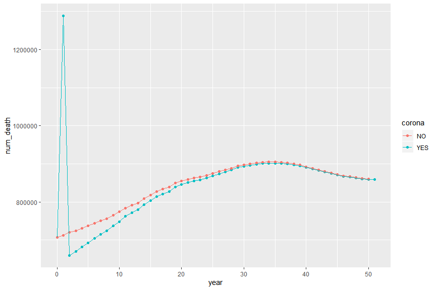
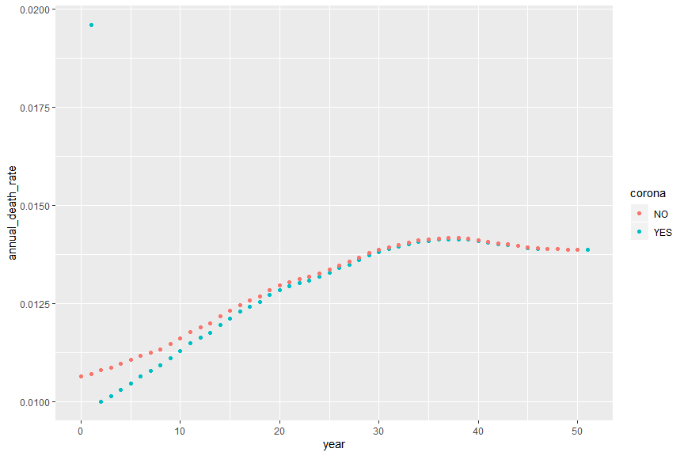
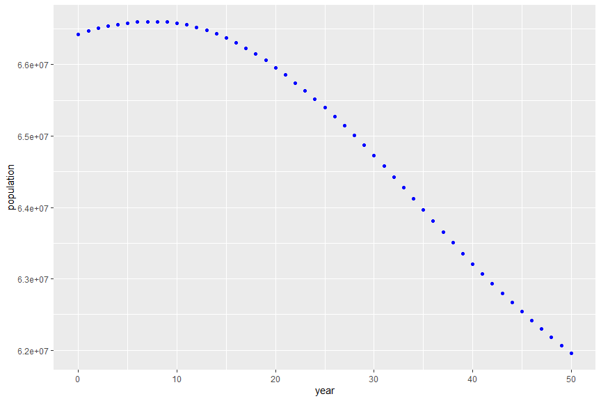
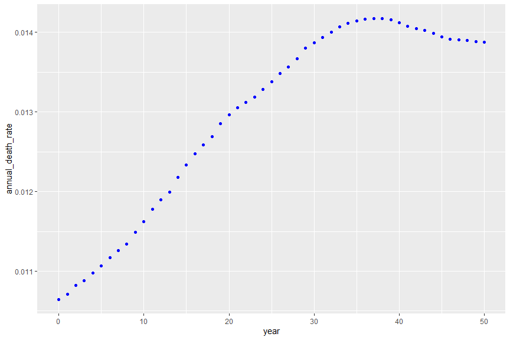
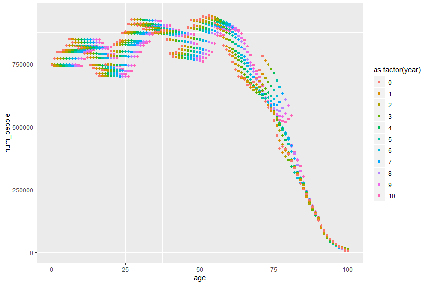
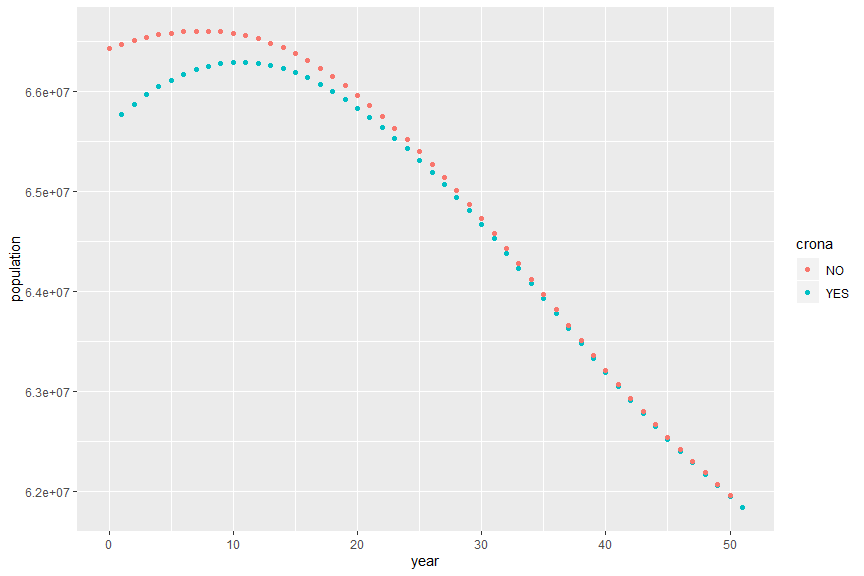
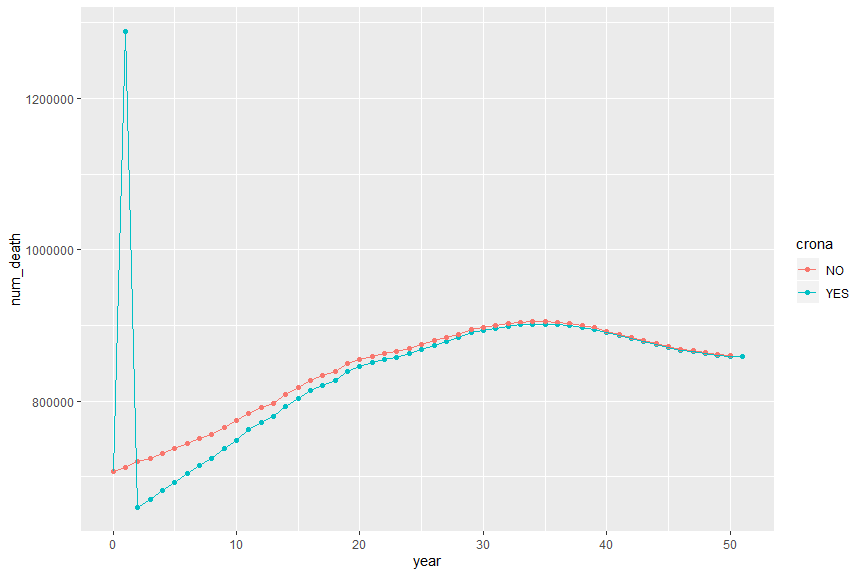
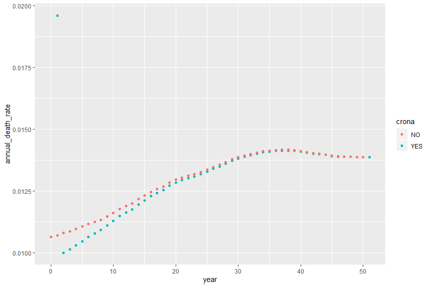
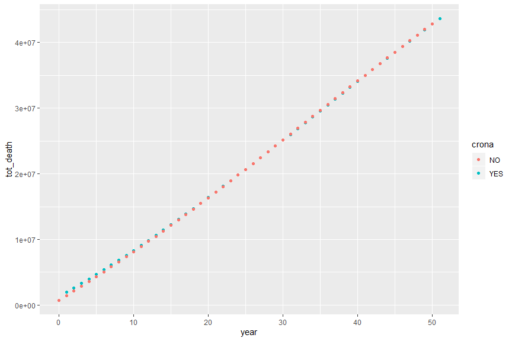
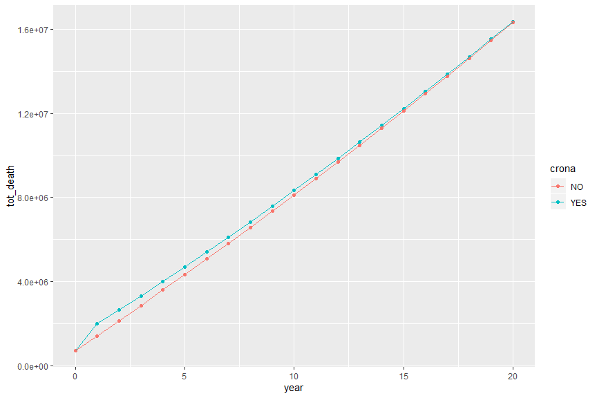

```r
#### INIT

library(dplyr)
```

```
## Warning: package 'dplyr' was built under R version 3.4.4
```

```
## 
## Attaching package: 'dplyr'
```

```
## The following objects are masked from 'package:stats':
## 
##     filter, lag
```

```
## The following objects are masked from 'package:base':
## 
##     intersect, setdiff, setequal, union
```

```r
library(ggplot2)

#### Read demo

demog <- 
    inner_join(read.csv("death_rate_v_age.csv"), read.csv("num_people_v_age.csv"), by = "age") %>%
    mutate(year = 0)

#### sanity checks

demog %>% 
    ggplot(aes(x = age, y = num_people)) + 
    geom_bar(stat = "identity", fill = "blue") +
    coord_flip() 
```

<!-- -->

```r
demog %>% 
    ggplot(aes(x = age, y = death_rate)) + 
    geom_point(colour = "blue") + 
    scale_y_log10()
```

<!-- -->

```r
demog %>% summarise(num_death = sum(num_people*death_rate), population = sum(num_people))
```

```
##   num_death population
## 1  706994.8   66427385
```

```r
demog %>% summarise(annual_rate = sum(num_people*death_rate) / sum(num_people))
```

```
##   annual_rate
## 1  0.01064312
```

```r
#### Generate next years

num_years <- 50
annual_birth <- 750000
demog_nocrona <- demog

for(i in (1:num_years)){
    demog_nocrona <- 
        demog_nocrona %>% 
        filter(year == max(year)) %>%
        mutate(num_people = num_people * (1-death_rate),
               num_people = num_people %>% lag(1),
               num_people = replace(num_people, is.na(num_people), annual_birth),
               year = year + 1) %>%
        rbind(demog_nocrona)
}

#### time-series summaries

demog_nocrona_summary <- 
    demog_nocrona %>% 
    group_by(year) %>% 
    summarise(num_death = sum(num_people*death_rate), population = sum(num_people)) %>%
    mutate(annual_death_rate = num_death/population)

demog_nocrona_summary %>% 
    ggplot(aes(x = year, y =annual_death_rate)) +
    geom_point(colour = "blue")
```

<!-- -->

```r
demog_nocrona_summary %>% 
    ggplot(aes(x = year, y =population)) +
    geom_point(colour = "blue")
```

<!-- -->

```r
demog_nocrona_summary %>% 
    ggplot(aes(x = year, y =annual_death_rate)) + 
    geom_point(colour = "blue")
```

<!-- -->

```r
demog_nocrona %>% 
    filter(year <= 10) %>%
    ggplot(aes(x = age, y = num_people, colour = as.factor(year))) + 
    geom_point() 
```

<!-- -->

```r
############# with crona

#### Generate next years

demog_crona <- demog

demog_crona <- 
    demog_crona %>% 
    filter(year == max(year)) %>%
    mutate(death_rate = 2 * death_rate, 
           num_people = num_people * (1-death_rate),
           num_people = num_people %>% lag(1),
           num_people = replace(num_people, is.na(num_people), annual_birth),
           year = year + 1) %>%
    rbind(demog_crona)

demog_crona <- 
    demog_crona %>% 
    filter(year == max(year)) %>%
    mutate(death_rate = death_rate / 2, 
           num_people = num_people * (1-death_rate),
           num_people = num_people %>% lag(1),
           num_people = replace(num_people, is.na(num_people), annual_birth),
           year = year + 1) %>%
    rbind(demog_crona)

for(i in (1:(num_years-1))){
    demog_crona <- 
        demog_crona %>% 
        filter(year == max(year)) %>%
        mutate(num_people = num_people * (1-death_rate),
               num_people = num_people %>% lag(1),
               num_people = replace(num_people, is.na(num_people), annual_birth),
               year = year + 1) %>%
        rbind(demog_crona)
}

#### time-series summaries

demog_crona_summary <- 
    demog_crona %>% 
    group_by(year) %>% 
    summarise(num_death = sum(num_people*death_rate), population = sum(num_people)) %>%
    mutate(annual_death_rate = num_death/population)

#### Comparing Crona and no-Crona

demog_summary <- 
    rbind(demog_crona_summary %>% mutate(crona = "YES"),
          demog_nocrona_summary %>% mutate(crona = "NO"))

demog_summary %>% ggplot(aes(x = year, y = population, colour = crona)) + geom_point()
```

<!-- -->

```r
demog_summary %>% ggplot(aes(x = year, y = num_death, colour = crona)) + geom_point() + geom_line() 
```

<!-- -->

```r
demog_summary %>% ggplot(aes(x = year, y = annual_death_rate, colour = crona)) + geom_point() 
```

<!-- -->

```r
demog_summary %>% 
    group_by(crona) %>%
    mutate(tot_death = cumsum(num_death)) %>%
    ggplot(aes(x = year, y = tot_death, colour = crona)) +
    geom_point()
```

<!-- -->

```r
demog_summary %>% 
    filter(year <= 20) %>%
    group_by(crona) %>%
    mutate(tot_death = cumsum(num_death)) %>%
    ggplot(aes(x = year, y = tot_death, colour = crona)) +
    geom_point() +
    geom_line()
```

<!-- -->
